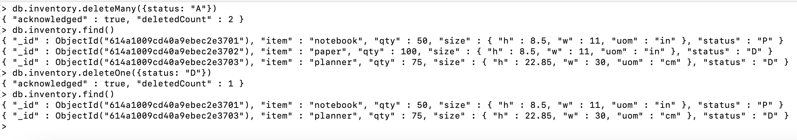

# DAT250-Assignment 3 Document report

### Installing MongoDB
**Correct validation of MongoDB:**

## Experiment 1
**Screenshots from the CRUD operations**

Insert documents:

Read documents:

Update documents:

Delete documents:

Bulk Write operations:

## Experiment 2
Using map-reduce aggregation to get the sum of the quantity-field by mapping
the customer-id to the quantity-field. Got a problem where the qty-value
is NaN.

